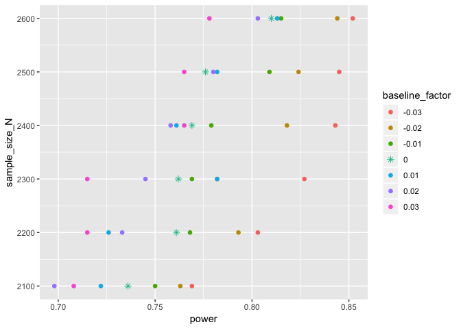

A-Priori Power by Simulation
================
Alessia Tosi
15/01/2018

In this script, I calculate the sample size necessary to detect the minimal effect of practical significance given the desired power using simulation.

The behavioural-insights RCT for the ONS Construction Survey uses a two-arm (i.e., between-subject) design. Stratification was used to control for possible confounding factors with Month of First Selection (Jan-May) as stratifying variable.

### Steps

Our data will be binary (1 if the business has responded by the deadline, 0 otherwise) and we'll analyse them using a generalised linear model (GLM) with a logit link function.

We will:

1.  Establish the effect that we want to be able to detect (the minimal effect size that is of PRACTICAL significance, i.e. that we want to be able to pick up if it is there) and sample size N

2.  Simulate N data for that possible effect, and do the GLM analysis on this simulated data.

3.  Collect the significant test result for the intervention effect.

4.  Re-run steps 3-4 a number of times (e.g., 1000 repetition). The proportion of times that we'll reject the null hypothesis is the power at that N.

5.  To determine the a-priori sample size to detect the desired effect for the desired power, we'll search over possible n values of N, re-run steps 2-4 for each value of N, and find the value that yeilds our desire power.

### Step 1: Determine minimal effect of practical significance

The trial focuses on the April 2018 data for businesses that newly joined the survey between January and April 2018, and May 2018 data for businesses that newly join the survey in that month.

Using historical data of the ONS Construction Survey, we can estimate the baseline (i.e., control-group) pre-deadline response rate. This is the weighted average of the pre-deadline response rates for the month of April and May in previous years, specifically:

-   historical April pre-deadline response rate for businesses which newly joined in January, February or March (`apr_prev_p0`)
-   historical April pre-deadline response rate for businesses which newly joined in that month (`apr_new_p0`)
-   historical May pre-deadline response rate for businesses which newly joined in that month (`may_new_p0`)

``` r
apr_new_p0 = 0.14
apr_prev_p0 = 0.17
may_new_p0 = 0.29

# control-group baseline as weighted average of past response rate by deadline
baseline_p0 <- (apr_new_p0 + apr_prev_p0*3 + may_new_p0)/5
```

The minimum intervention effect can be seen as the minimum odds ratio of practical interest associated with intervention allocation. In our case, we established that an increase of 4 percentage points in the rate of businesses that respond to the survey by the deadline would be considered successful in terms of resources saved from response chasing.

``` r
# minimum desired effect
min_de <- 0.04

intervention_p1 <- baseline_p0 + min_de

( odds_intervention <-  intervention_p1/(1-intervention_p1) )
```

    ## [1] 0.2953368

``` r
( odds_baseline <-  baseline_p0/(1-baseline_p0) )
```

    ## [1] 0.2315271

``` r
( odds_ratio <- odds_intervention / odds_baseline )
```

    ## [1] 1.275604

``` r
# minimum desired effect as log-odds given the expected control-group frequency
( beta_logodds <- log(odds_ratio))
```

    ## [1] 0.2434195

### Step 2-4: Simulate N data for that possible effect, and do the analyse on this simulated data.

Let us assume a sample size N = 2300 businesses and calculate what the power to detect our minimum desired effect (i.e., an increase of 4 percentage points in the rate of businesses that respond by the deadline) would be.

Set sample size N:

``` r
N = 2300

# sample size in each group (taking into account strata)
n = N/10
```

Set number of repetition:

``` r
repetitions = 1000
```

Create variables refecting the trial design:

``` r
var_cond <- rep(c('Inter', 'Control'), each=5)
var_cond <- relevel(factor(var_cond), ref='Control')

var_strata <- rep(c( 'jan', 'feb', 'mar', 'apr', 'may'),2)

var_cond <- rep(var_cond, times=n)
var_strata <- rep(var_strata, times=n)
```

Expected control-group and intervenion-group response rate given the minimum desired effect:

``` r
rates  = c( apr_prev_p0, apr_prev_p0, apr_prev_p0, apr_new_p0, may_new_p0, 
      apr_prev_p0+min_de, apr_prev_p0+min_de, apr_prev_p0+min_de, apr_new_p0+min_de,may_new_p0+min_de)
```

Calculation of power:

``` r
set.seed(42)

significant = matrix(nrow=repetitions, ncol=7)

startT = proc.time()[3]

for(i in 1:repetitions){
      
      # simulate responses based on control- and desired inervention-group response rates
      responses          <- rbinom(n=N, size=1, prob=rates)
      
      # analyse the simulated data
      model              <- glm(responses~var_cond+var_strata, family=binomial(link="logit"))
      
      # extract the one-sided (right-tail) Wald's z test for intervention
      significant[i,1]   <- (summary(model)$coefficients[2,4]/2 <.05)
      
      # extract the significance results for the strata/co-variates (we are not interested in them) 
      significant[i,2:5] <- (summary(model)$coefficients[3:6,4]<.05)
      
      significant[i,6]   <- sum(significant[i,1:5])
      
      modelDev           <- model$null.deviance-model$deviance
      significant[i,7]   <- (1-pchisq(modelDev, 5))<.05
      
      }

endT = proc.time()[3]
endT-startT
```

    ## elapsed 
    ##  14.897

If there was an effect of +4 percentage points in timed responses due to the intervention (from baseline 18.8% to 22.8% (i.e., odds ratio of 1.2756036) and we had a sample size of 2300 businesses, then we would have 0.757 power to detect that effect.

``` r
sum(significant[,1])/repetitions
```

    ## [1] 0.757

### Step 5: Determine the sample size to detect the desired effect given the desired power

To determine the a-priori sample size to detect the desired effect for the desired power, we'll search over possible n values of N, re-run steps 2-4 for each value of N, to find the value that yeilds our desire power.

To do this, I created a function, `power_by_sim_fun()` that reproduces steps 2-4 above.

``` r
source("power_by_sim_fun.R")
```

Let's take a look a its arguments but you can find more info in the .R file.

``` r
args(power_by_sim_fun)
```

    ## function (N = 2300, min_de = 0.04, repetitions = 1000, n_conditions = 2, 
    ##     n_strata = 5, names_strata = c("jan", "feb", "mar", "apr", 
    ##         "may"), baselines = c(0.17, 0.17, 0.17, 0.14, 0.29), 
    ##     baseline_factor = 0, one_side_test = TRUE) 
    ## NULL

Let's iterate over possible sample size values N and possible baseline response rates.

``` r
# WARNING: it will take a while...

num_rows <- length(bf_pool)

collect_results_perN <- list()    # empty list to collect results

index = 0

set.seed(321)

for (n in N_pool){      # iterate over possible sample size values N
      index = index + 1 
      collect_bf_results <- matrix(nrow = num_rows, ncol=3)
      collect_bf_results[, 3] <- n
      
      for (i in 1:length(bf_pool)){ # iterate over possible baseline response rates
            bf <- bf_pool[i]
            collect_bf_results[i, 1] <- bf
            collect_bf_results[i, 2] <- power_by_sim_fun(rep=1000, N=n, baseline_factor=bf, min_de=0.04)
            
            }
      
      collect_results_perN[[index]] <- as.data.frame(collect_bf_results)
      }


power_results_df <- do.call('rbind', collect_results_perN)
colnames(power_results_df) <- c('baseline_factor', 'power', 'sample_size_N')
```

As the plot below shows, a sample size between 2400 and 2600 would give us a power between 0.765 and 0.852 to detect our minimum desired effect, depending on the deviation of the by-deadline response rate in the observed control group compared to the historical rate.



### References

<https://stats.stackexchange.com/questions/22406/power-analysis-for-ordinal-logistic-regression/22410#22410>

<https://stats.stackexchange.com/questions/35940/simulation-of-logistic-regression-power-analysis-designed-experiments/36040#36040>

<https://stats.stackexchange.com/questions/111308/why-is-power-analysis-with-logistic-regression-so-liberal-compared-to-chi-square?rq=1>
